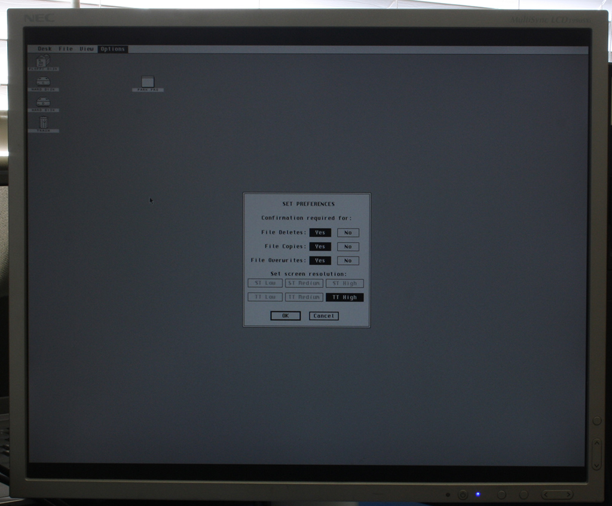
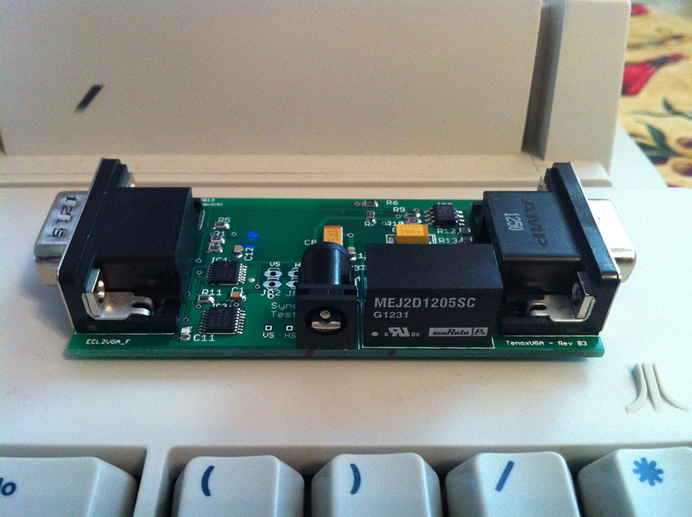

# ECL2VGA Adapter for Atari TT High Res Mode

TenoxVGA is an adapter that lets you use a standard LCD flat panel or a CRT monitor with Atari TT built-in video card in TT-HIGH mode (1280x960). You can think of it as TTM194 or TTM195 monitor replacement or ECL to VGA video signal converter.

Atari TT traditionally lets you use VGA monitors in ST and TT low to medium resolutions. The maximum you can get on a standard monitor or a flat panel is 640x480 with a rather large white border around. In order to go any higher than that you need to have a special ECL monitor such as TTM194 / TTM195, or a VME bus graphics card. These are nowadays rather hard to come by. This project was conceived to fix this issue. There are few other projects that convert ECL to TTL signal. Unfortunately they only allow non-Atari ECL CRTs such as EIZO to be used in TT-HIGH mode. This adapter is a full signal conversion from ECL to VGA and allows you to use any standard VGA monitor or flat panel.



The adapter plugs in directly to the Atari TT monitor port and switches the computer in to TT-HIGH mode. Just connect your standard LCD panel or CRT monitor, no drivers, configuration changes or opening the case / soldering required. TenoxVGA requires a 12V external power supply to operate. It is possible to draw power from TT internal PSU by using Y splitter cable for HDD power. Also the device plugs directly to Atari TT video port which requires some additional space on back of the computer. 



## Technical Specifications

```
Input Port: Atari TT DSUB Video port
Output Port: Standard VGA 15 pin DSUB
Resolution: 1280 x 960
Colors: 2 (BW), 1 BPP
Aspect ratio: 4:3
H. Sync: 71.911 KHz
V. Sync: 71.624 Hz
Power Source: external 12V DC, Centre Positive
DC Power Plug: 2.1mm ID x 5.5mm OD x 9.5mm plug 
Case Dimensions: 85mm x 41mm x 21mm
```

## LCD Panel Compatibility

In order to achieve best image quality your lcd panel should support 1:1 scaling mode, or scaling off. This is because TT-HIGH mode is 1280x960 whereas most panels have 1280x1024 or some other variant of 5:4 aspect ratio. If your lcd panel doesn't support scalling off or 1:1 mode the picture may be stretched. Also you should set contrast to 100% and tweak some other parameters.

The best LCD panels for TT and TenoxVGA are NEC 1990SXi however generally most older NEC LCD panels support 1:1 / scaling off.

If you cannot find a suitable LCD panel, anternatively you can use Extron [RGB-HDMI 300 scaler](https://www.extron.com/product/rgbhdmi300a). They can be found on eBay for less than $100. The Extron scaler will be able to correctly pre-scale and pre-adjust the image (including 100% contrast) to correctly display it on any modern day HDMI based LCD panel.

## Ordering

You can currently purchase boards from [Legacy Pixels](https://www.legacypixels.com/atari)

Also experimentally you can build to order on [PCBWay](https://www.pcbway.com/project/shareproject/TenoxVGA___ECL2VGA_Adapter_for_Atari_TT_High_Res_Mode.html)

## Credits
* Copyright © 2013 by Antoni Sawicki <as@tenoware.com>
* The device was originally designed and manufactured by MSDUS http://www.msdus.com/

## License
Apache 2.0

The copyright holder of this project hereby grants you explicit permission to produce and sell devices based on this project, reproduce, copy, clone, make new projects and producs, sell and distribute. This includes rights to names "TenoxVGA", "ECL2VGA" or use any name you want on the derivative work.
